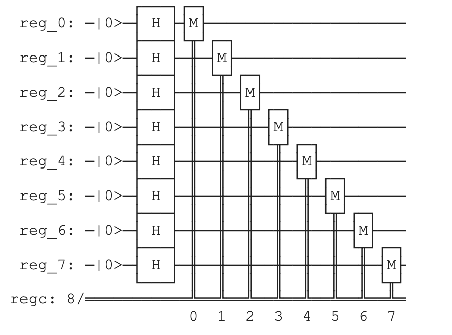

# Random Byte



**Import Statements**

```python
from qiskit import (
  QuantumCircuit,
  QuantumRegister,
  ClassicalRegister,
  execute,
  Aer,
  IBMQ,
  BasicAer,
)
import math
```

* **qiskit**: This is the core Qiskit library providing tools for creating and manipulating quantum circuits.
* **QuantumCircuit, QuantumRegister, ClassicalRegister**: Classes for building quantum circuits, defining quantum registers (qubits), and classical registers (classical bits).
* **execute, Aer, BasicAer**: Functions and classes for running quantum simulations. `execute` runs the circuit on a backend, and `BasicAer.get_backend("statevector_simulator")` provides a statevector simulator.

**Circuit Setup**

```python
reg = QuantumRegister(8, name="reg")
reg_c = ClassicalRegister(8, name="regc")
qc = QuantumCircuit(reg, reg_c)
```

* **QuantumRegister(8, name="reg")**: Creates a quantum register of 8 qubits named "reg".
* **ClassicalRegister(8, name="regc")**: Creates a classical register of 8 classical bits named "regc".
* **QuantumCircuit(reg, reg_c)**:  Creates a quantum circuit combining the quantum and classical registers.

**Circuit Operations**

```python
qc.reset(reg)  # write the value 0
qc.h(reg)  # put it into a superposition of 0 and 1
qc.measure(reg, reg_c)  # read the result as a digital bit
```

* **qc.reset(reg):** Resets all the qubits in the quantum register 'reg' to the |0⟩ state.
* **qc.h(reg):** Applies the Hadamard gate to all qubits in the register. This puts all 8 qubits into a superposition of |0⟩ and |1⟩.
* **qc.measure(reg, reg_c):** Measures each qubit in the 'reg' register and stores the results in the corresponding classical bit in 'reg_c'.

**Simulation and Result Processing**

```python
backend = BasicAer.get_backend("statevector_simulator") 
job = execute(qc, backend) 
result = job.result() 

counts = result.get_counts(qc) 
print("counts:", counts) 
for key, val in counts.items():
  n = sum([(int(x) << i) for i, x in enumerate(key)]) 
  print("Random number:", n) 
```

* **backend = ... :** Sets up a statevector simulator for simulating the quantum circuit. 
* **job = execute(qc, backend):** Runs the circuit 'qc' on the simulator.
* **result = job.result():** Gets the results of the simulation.
* **counts = ... :** Extracts a dictionary showing how many times each possible measurement outcome occurred.
* **for key, val ... :** The loop converts each measurement outcome (e.g., '01011010') from binary representation to a decimal integer and prints it as a random number.
