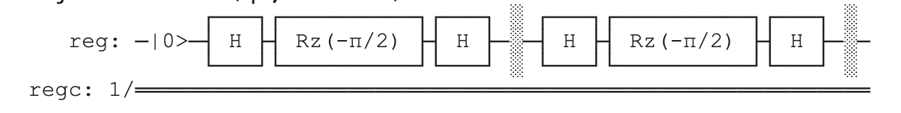

### Understanding the Root of NOT Operation



First, to understand what the "root of NOT" means, let's start with a classical analogy. Imagine you have a light switch that toggles a light between on and off states. The NOT operation is like flipping the switch: if the light is on, it turns it off, and vice versa. Now, imagine an operation that, if you do it twice, would be equivalent to flipping the switch once. That's what the "root of NOT" operation is like in the quantum world. It's an operation that, when applied twice, has the same effect as applying the NOT operation once.

### Breaking Down the Code

The code consists of two main parts: the definition of the `ApplyRootOfNot` operation and the `DemonstrateRootOfNot` operation which uses it.

#### ApplyRootOfNot Operation

- **Hadamard (H) Gate**: This gate is used to create superposition. Applying it to a qubit changes its state from a definite 0 or 1 to a combination (superposition) of both. It's like spinning a coin so it's neither heads nor tails but both at the same time.
- **Rz Gate**: This gate rotates the qubit around the Z-axis of the Bloch sphere by a specified angle. In this case, `-PI() / 2.0` is the angle, which means it rotates the qubit 90 degrees. Think of the qubit as a globe, and the Rz gate rotates it around the north-south pole axis.
- **Repeating the H and Rz Gates**: By applying the H, Rz, and H gates in sequence twice, we effectively apply the square root of the NOT operation. The choice of the Rz angle and the use of Hadamard gates before and after are crucial for achieving the desired transformation on the qubit's state.

#### DemonstrateRootOfNot Operation

- **Initialization**: A qubit is allocated and implicitly set to the |0⟩ state, which is the standard starting point for quantum operations.
- **Applying RootOfNot**: The `ApplyRootOfNot` operation is then applied to this qubit.
- **Measurement**: The qubit's state is measured with the `M` operation, collapsing its state to either |0⟩ or |1⟩ based on the probabilities defined by its superposition. This measurement is outputted for observation.
- **Reset**: Finally, the qubit is reset to its initial state, which is a good practice for ensuring the system is clean for subsequent operations.

### What's Happening Physically and Mathematically?

When we apply the sequence of operations H, Rz, H twice, we're effectively changing the state of the qubit in a way that, if we were to measure it, we'd find it in a state that reflects the application of a NOT operation, but done in a gradual way due to the square root nature of the operation. It's like changing the direction of our spinning coin gradually so that if we were to do this operation twice, the coin would end up in the opposite state to where it started.

### Quantum Circuit Example in Qiskit

To give you an example in Python using Qiskit, which is another quantum computing framework, we can simulate the same behavior:

```python
from qiskit import QuantumCircuit, Aer, execute
from qiskit.visualization import plot_histogram
from math import pi

# Create a quantum circuit with 1 qubit
qc = QuantumCircuit(1)

# Apply the root of NOT operation twice
# Hadamard gate
qc.h(0)
# Rz gate with -pi/2 rotation
qc.rz(-pi / 2, 0)
# Hadamard gate
qc.h(0)
# Repeat
qc.h(0)
qc.rz(-pi / 2, 0)
qc.h(0)

# Measure the qubit
qc.measure_all()

# Execute the circuit
backend = Aer.get_backend('qasm_simulator')
result = execute(qc, backend, shots=1024).result()
counts = result.get_counts()

# Plot the result
plot_histogram(counts)
```

This Qiskit code snippet creates a quantum circuit that applies the root of NOT operation twice to a single qubit, then measures the result. The `plot_histogram` function will show the probabilities of measuring the qubit in the |0⟩ or |1⟩ state, giving a visual representation of the outcome.