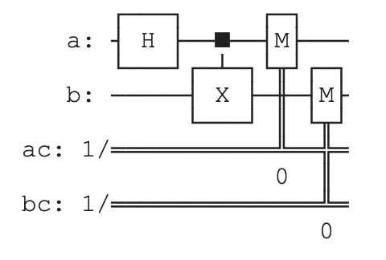

# Entangled qubits



### Namespace and Libraries
```qsharp
namespace Sample {
    open Microsoft.Quantum.Diagnostics;
```
- **Namespace `Sample`**: This is the container for the program. It groups the operation into a module.
- **`open Microsoft.Quantum.Diagnostics`**: This line imports the `Diagnostics` library, which provides tools for inspecting and understanding the quantum state during simulation, such as the `DumpMachine` function.

### Main Operation
```qsharp
@EntryPoint()
operation EntangleQubits() : (Result, Result) {
```
- **`@EntryPoint()`**: This attribute indicates that this operation is the entry point of the program, meaning it's where the program starts execution.
- **`operation EntangleQubits() : (Result, Result)`**: Defines an operation named `EntangleQubits` that, when executed, will return a tuple containing two `Result` values. These results are the outcomes of measuring two qubits.

### Quantum Operations
```qsharp
use (q1, q2) = (Qubit(), Qubit());
```
- **`use (q1, q2) = (Qubit(), Qubit())`**: Allocates two qubits for use in the program. In quantum computing, qubits are the basic units of quantum information.

```qsharp
H(q1);
CNOT(q1, q2);
```
- **`H(q1)`**: Applies a Hadamard gate to the first qubit (`q1`). The Hadamard gate puts `q1` into a superposition state, meaning it's in a state where, if measured, it has an equal probability of being found in either the `0` or `1` state.
- **`CNOT(q1, q2)`**: Applies a Controlled-NOT (CNOT) gate to the two qubits, with `q1` as the control qubit and `q2` as the target. If `q1` is in the `1` state, it flips `q2`; if `q1` is in the `0` state, `q2` remains unchanged. This operation entangles the qubits, meaning their states are now correlated: the state of one cannot be described independently of the state of the other.

### Diagnostics and Measurement
```qsharp
DumpMachine();
```
- **`DumpMachine()`**: This function outputs the current quantum state of the simulator to the console. It's useful for debugging and learning purposes, as it shows the probabilities and phases of the quantum states.

```qsharp
let (m1, m2) = (M(q1), M(q2));
```
- **`let (m1, m2) = (M(q1), M(q2))`**: Measures both qubits and stores the results in `m1` and `m2`, respectively. The `M` function returns a `Result`, which can either be `Zero` (for a measurement of `0`) or `One` (for a measurement of `1`). Because the qubits are entangled, the measurement results will be correlated, meaning if one qubit is measured as `0`, the other will also be measured as `0`, and similarly for `1`.

### Reset and Return
```qsharp
Reset(q1);
Reset(q2);
return (m1, m2);
```
- **`Reset(q1); Reset(q2);`**: Resets both qubits to their initial state (`|0⟩`). This is important for cleaning up and ensuring qubits are in a known state for future operations.
- **`return (m1, m2);`**: Returns the measurement results as a tuple. This is the output of the operation and can be used for further processing or verification of entanglement.

### Summary
This Q# program demonstrates creating an entangled pair of qubits through quantum operations, inspecting the quantum state, measuring the qubits to observe their correlated outcomes, and then cleaning up by resetting the qubits. It beautifully illustrates the quantum entanglement phenomenon, where the state of one qubit instantaneously affects the state of another, no matter the distance between them.